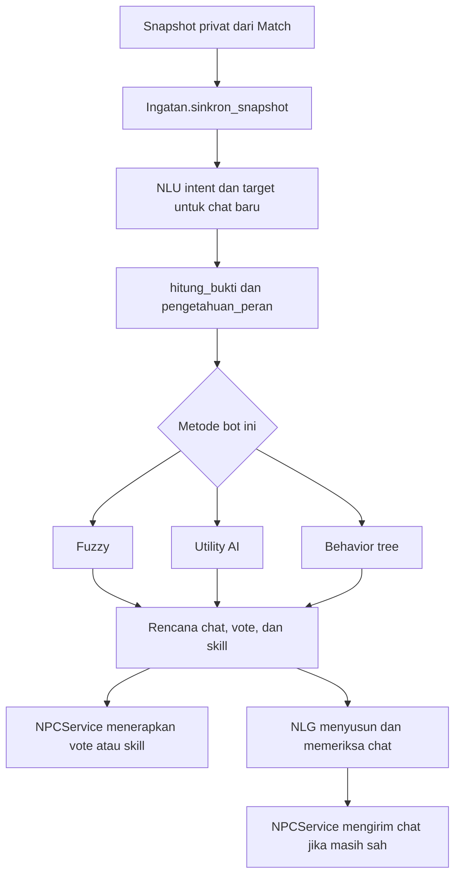

# Mulai di sini: bagaimana bot kita berpikir?

Panduan lokal — dibaca dari kode pada 1 Oktober 2026. Ditulis untuk pembaca yang baru belajar pemrograman. Buka panduan ini berdampingan dengan notebook, lalu gunakan Ctrl+F untuk mencari nama fungsi yang disebut.

## Bayangkan permainan detektif di kelas

Ada beberapa pemain. Ada Hitman yang menyembunyikan perannya. Pemain lain perlu mendengarkan percakapan, mencari petunjuk, dan memilih tersangka. Bot menjalani proses yang mirip:

1. **Membaca keadaan:** sekarang siang, malam, atau Tribunal? Siapa yang masih hidup? Apa yang boleh dilakukan bot?
2. **Membaca ucapan:** kalimat itu menuduh, membela, atau netral? Siapa yang dituju?
3. **Mengingat petunjuk:** siapa menuduh siapa, siapa mengubah sikap, siapa di-vote?
4. **Memilih langkah:** bicara, vote, menggunakan skill, atau menunggu.
5. **Menyusun kalimat:** mengubah rencana menjadi chat yang terdengar wajar.
6. **Meminta engine menjalankan tindakan:** engine tetap menentukan sah atau tidaknya aksi.

Bot tidak boleh membuka daftar role rahasia semua pemain. Ia menerima snapshot privat miliknya sendiri. Karena itu, diamnya pemain lain hanya petunjuk: belum membuktikan bahwa pemain itu Hostage.

## Urutan membaca

| File | Pertanyaan yang dijawab |
| --- | --- |
| [01_NLU_INTENT.md](01_NLU_INTENT.md) | Bagaimana chat dibaca sebagai menuduh, membela, atau netral? |
| [02_NLU_TARGET.md](02_NLU_TARGET.md) | Siapa yang dituduh/dibela oleh kalimat itu? |
| [03_FUZZY_LOGIC.md](03_FUZZY_LOGIC.md) | Bagaimana petunjuk dinilai memakai kategori yang dapat tumpang tindih? |
| [04_UTILITY_AI.md](04_UTILITY_AI.md) | Bagaimana bot memberi nilai kegunaan pada pilihan tindakan? |
| [05_BEHAVIOR_TREE.md](05_BEHAVIOR_TREE.md) | Bagaimana bot mengikuti urutan kondisi dan prioritas? |
| [06_NLG_DAN_INTEGRASI.md](06_NLG_DAN_INTEGRASI.md) | Bagaimana keputusan menjadi kalimat dan benar-benar diterapkan di game? |

## Peta alur sebenarnya

**Fuzzy, utility AI, dan behavior tree merupakan alternatif.** Satu bot dalam mode campuran memakai salah satu metode. Bukan setiap pesan harus melewati fuzzy, lalu utility, kemudian BT. `BrainRuntime._bagi_metode` membagikan metode kepada bot; `BrainRuntime.langkah` memanggil `putuskan` dari modul yang sesuai. Mode `llm` memiliki jalur keputusan lama tersendiri; jangan menyamakan jalur itu dengan ketiga metode notebook.

## Peta nama dalam kode

| Nama | Ibaratnya | Isi/pemakaian |
| --- | --- | --- |
| `snapshot` | Foto keadaan dari server | Data engine: `round`, `phase`, `players`, `me`, `messages`. |
| `view` | Foto yang sudah dirapikan | Nama field diubah untuk notebook: `ronde`, `fase`, `saya`, `pemain`. |
| `Ingatan` | Buku catatan satu bot | Riwayat chat, vote, eksekusi, intel, dan aksi bot. Bukan memori bersama semua bot. |
| `tabel` | Rapor bukti per pemain | Satu baris per pemain; kolom tekanan, dukungan, pengalihan, dan seterusnya. |
| `konteks` | Ringkasan situasi meja | Urgensi, porsi fase, arah suara, apakah bot ditanya/dituduh. |
| `pengetahuan` | Fakta atau simpulan khusus role | Misalnya hasil Peek dan rekan Syndicate. Beberapa dugaan serangan juga disimpan di sini; lihat syarat fungsinya. |
| `ctx` | Tas yang membawa semuanya | Dictionary berisi view, ingatan, tabel, konteks, izin, dan pengetahuan untuk fungsi keputusan. |
| `rencana_chat` | Isi yang ingin diucapkan | Aksi percakapan, intent, target, alasan, izin kirim. Belum tentu sudah terkirim. |
| `npc_decision` | Instruksi ke game | `action`, `target`, `message`. Vote/skill harus diterima engine. |

Ada **dua arti target** yang harus dibedakan:

- Target NLU: “Andi sedang menuduh **Budi**.” Ini membaca pesan Andi.
- Target keputusan: “Bot memilih vote **Citra**.” Ini pilihan bot setelah menimbang seluruh petunjuk.

Bot tidak wajib ikut menuduh orang yang baru disebut pemain lain.

## Petunjuk yang dipakai ketiga metode

`hitung_bukti` mengubah pengamatan menjadi angka, umumnya 0–1. Contoh `tekanan=0.7` berarti tekanan relatif tinggi menurut rumus kode; bukan peluang 70% bahwa orang itu Hitman.

| Bukti | Dari mana? | Kapan berguna? |
| --- | --- | --- |
| `tekanan` / `dukungan` | Penuduh, vote, dan pembela yang berbeda; bukti lama diluruhkan. | Melihat bagaimana seorang pemain dinilai orang lain. |
| `inkonsistensi` | Perubahan sikap terhadap target dan ketidaksesuaian ucapan dengan vote. | Melihat tindakan yang tampak bertentangan. |
| `pengalihan` | Setelah dituduh, pemain menuduh pihak lain. | Menilai pola mengalihkan perhatian. |
| `dituduh_korban` | Tuduhan dari orang yang kemudian diduga terkena Hostage/Gag. | Menelusuri siapa yang mungkin membungkam penuduhnya. |
| `dorong_salah_eksekusi` | Tuduhan/vote yang mendorong eksekusi warga, dengan syarat kepastian/pembobotan di kode. | Memakai akibat ronde sebelumnya. |
| `serang_bersih` | Menyerang pemain yang bot ketahui bersih. | Memakai pengetahuan privat bot secara sah. |
| `klaim` | Klaim role bertentangan atau klaim Peek bermasalah. | Memeriksa cerita pemain. |
| `p_sandera` | Pola aktivitas/chat/vote yang menghilang. | Mengurangi kemungkinan salah menuduh korban; masih dugaan. |

`relasi_chat` menyaring intent di luar offend/defend dan confidence intent di bawah 0,60. Pengirim yang mengulang tuduhan tidak menambah jumlah penuduh unik pada `tekanan`, tetapi jangan menganggap semua jenis bukti otomatis kebal spam.

## Role mengubah tujuan

| Role bot | Cara memakai hasil penalaran |
| --- | --- |
| Civilian | Diskusi dan vote; tidak punya skill malam. |
| Spy | Diskusi/vote serta memilih Guard. Tidak boleh menjaga target yang sama dua malam berturut-turut. |
| Stalker | Diskusi/vote serta Peek. Hasil Peek privat dapat mengalahkan skor dugaan. |
| Hitman | Menilai ancaman warga dan calon kambing hitam; memilih Hostage/Gag dan strategi vote. Rekan Syndicate dikecualikan dari kandidat serangan. |

Vote warga dan Hitman tidak memakai aturan persis sama. Ketiga metode memanggil fungsi bersama `keputusan_vote_hitman` untuk strategi vote Hitman.

## Buka kode dari pintu ini

1. [runtime.py](../../../../Games/backend/services/npc_brain/runtime.py): cari `BrainRuntime.langkah`.
2. Buka salah satu notebook NPC; cari `putuskan`. Ini pintu utama penalaran.
3. Dari sana ikuti `hitung_bukti` → `pengetahuan_peran` → penilaian metode → keputusan chat/vote/skill.
4. [npc_service.py](../../../../Games/backend/services/npc_service.py): cari `brain_turn` untuk melihat penerapannya.
5. [match_engine.py](../../../../Games/backend/services/match_engine.py): cari `act`, `vote`, dan `can_chat` untuk aturan final.

Notebook adalah sumber logika. Berkas `Games/backend/services/npc_brain/generated/` adalah hasil ekspor. Perubahan logika seharusnya dibuat di notebook, diperiksa, lalu diekspor memakai [ekspor_otak_npc.py](../../../../Games/backend/scripts/ekspor_otak_npc.py).

## Mana yang berjalan sekarang, mana yang masih usulan?

Saat panduan dibuat, batas chat masih **3 per fase siang dan 2 per fase Tribunal**. Pengecualian baru untuk menjawab setelah kuota habis, jeda 6 detik, dan batas 3 respons/30 detik **belum diterapkan**. Jangan menganggap percakapan desain sebagai perilaku kode yang sudah aktif.

Audit juga menemukan masalah urutan/waktu chat, relasi target pada kalimat campuran, dan beberapa celah validasi. Penjelasan di sini menggambarkan implementasi, bukan menjamin semua keputusannya benar. Lihat [audit beserta reproduksi](../../reports/audit_ai_20261001/AUDIT.md).

Folder panduan ini diabaikan Git melalui `/ai_2_dataset_baru/panduan_kode_lokal/` pada .gitignore root. Notebook dan kode game tidak dimasukkan ke aturan ignore tersebut.
